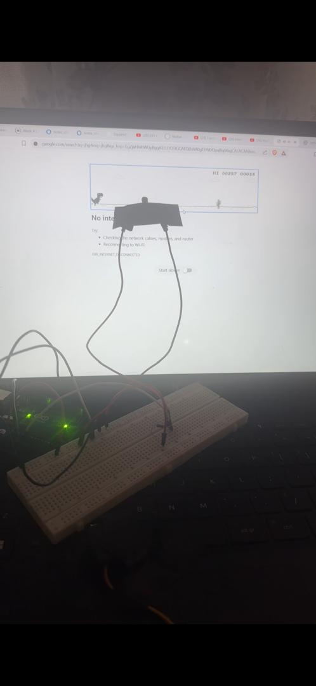

# 🦖 Autonomous Dino Game Player (Arduino Uno + LDR + Servo)

This project plays the **Chrome Dino Game automatically** by detecting obstacles on the screen using an **LDR (light sensor)**.  
When the LDR senses a dark shape (a cactus), the Arduino moves a **servo motor** that physically presses the **spacebar** to make the Dino jump.

---

## ⚙️ Components
- **Arduino Uno**
- **SG90 / MG90S Servo Motor**
- **LDR (Light Dependent Resistor)**
- **10kΩ Resistor** (for voltage divider)
- **Jumper Wires**
- **Tape** (to mount LDR to screen)

---

## 🔌 Circuit Connections

### **LDR Voltage Divider**
| Component        | Arduino Pin | Notes                |
|------------------|-------------|----------------------|
| LDR Leg 1        | 5V          | Power                |
| LDR Leg 2        | A0          | Reads light level    |
| 10kΩ Resistor    | A0 → GND    | Completes divider    |

### **Servo Motor**
| Servo Wire       | Arduino Pin | Notes                |
|------------------|-------------|----------------------|
| **Red**          | 5V          | Power                |
| **Brown/Black**  | GND         | Ground               |
| **Orange/Yellow**| **D6**      | Signal pin           |

---

## 📷 Setup
- Tape the **LDR** to your screen directly over the Dino’s running path.  
- Position the **servo horn** directly above the spacebar.  
- When a cactus appears, the screen darkens → LDR detects the drop → servo taps the key.

---

## 🧠 How It Works
1. The LDR constantly measures brightness.  
2. When a cactus appears, brightness **drops sharply**.  
3. Arduino compares the reading to a threshold.  
4. If the reading is lower → servo moves → Dino jumps.  
5. Runs automatically in real time.

---

## Project Images

### Servo Setup

### LDR Placement

### Final Build

---
## 📝 Notes
- Adjust the **threshold value** depending on monitor brightness.
- Keep room lighting stable.
- Make sure the servo horn is aligned with the spacebar for reliable jumping.

